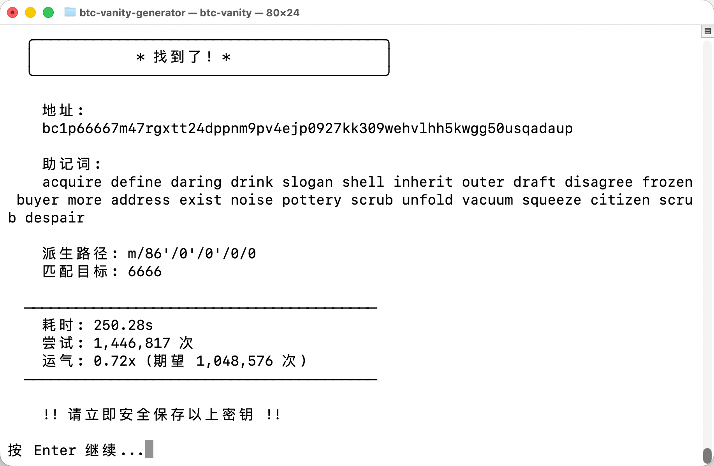

# BTC Vanity Generator

比特币靓号地址生成器，支持所有主流地址类型。



市面上的生成器大多只支持1开头的老地址，不支持 bc1p/bc1q，也没有助记词生成。这个工具用 Rust 写的，性能拉满，支持所有地址类型。

**安全性**：完全离线运行，不存储任何数据，按 Enter 后自动清屏。建议开飞行模式使用。

## 功能

- 支持 bc1p (Taproot) / bc1q (SegWit) / 1xxx (Legacy) / 3xxx (P2SH)
- 多目标同时搜索
- 实时进度条 + 运气值显示
- 输出助记词或私钥

## 速度估算

基于 Apple M3 芯片 (~5,000/s)

**Bech32 地址 (bc1p/bc1q)** - 32字符集

| 位数 | 期望尝试 | 预计时间 |
|------|----------|----------|
| 3 | 32,768 | 7秒 |
| 4 | 1,048,576 | 3.5分钟 |
| 5 | 33,554,432 | 1.9小时 |
| 6 | 1,073,741,824 | 2.5天 |
| 7 | 34,359,738,368 | 79天 |

**Base58 地址 (1xxx/3xxx)** - 58字符集

| 位数 | 期望尝试 | 预计时间 |
|------|----------|----------|
| 3 | 195,112 | 39秒 |
| 4 | 11,316,496 | 38分钟 |
| 5 | 656,356,768 | 1.5天 |
| 6 | 38,068,692,544 | 88天 |

> 实际时间取决于运气，可能更快或更慢

## 编译

需要 Rust 1.70+

```bash
# macOS / Linux
cargo build --release
./target/release/btc-vanity

# Windows
cargo build --release
.\target\release\btc-vanity.exe
```

## 字符集

**Bech32** (bc1p/bc1q): `qpzry9x8gf2tvdw0s3jn54khce6mua7l`

**Base58** (1xxx/3xxx): `123456789ABCDEFGHJKLMNPQRSTUVWXYZabcdefghijkmnopqrstuvwxyz`

## 派生路径

| 类型 | 路径 | BIP |
|------|------|-----|
| Taproot | m/86'/0'/0'/0/0 | BIP86 |
| SegWit | m/84'/0'/0'/0/0 | BIP84 |
| Legacy | m/44'/0'/0'/0/0 | BIP44 |
| P2SH | m/44'/0'/0'/0/0 | BIP44 |

## License

MIT
